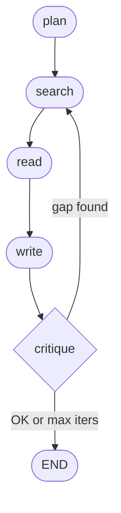

# LangGraph Research Agent

[](https://github.com/wzltmp/langgraph-research-agent/actions/workflows/ci.yml)
[](https://www.python.org/downloads/)
[](https://github.com/astral-sh/ruff)
[](http://mypy-lang.org/)
[](#license)

A stateful research agent that plans, searches the web, reads sources, and writes a cited report — built with LangGraph as a graph of nodes with a bounded critique loop.

**Live demo:** _(URL added after deploy)_
**Stack:** LangGraph · Claude Sonnet 4.6 + Haiku 4.5 · Tavily Search · Streamlit

---

## What it does

Given a research question, the agent (1) breaks it into sub-queries, (2) searches each via Tavily, (3) fetches and summarizes the top sources, (4) drafts a 250-400 word report with inline `[n]` citations, and (5) self-critiques the draft. If the critic finds gaps, the agent re-plans and searches again — capped at 2 total iterations to prevent thrash.

The architecture mirrors how production research agents (Perplexity, OpenAI Deep Research, Anthropic's research mode) are actually built: a graph of specialized nodes passing shared state, not a single monolithic prompt.

## Eval results (n = 20 queries, scored 1-5 by Claude Sonnet judge)

20 questions across three buckets: factual / single-hop (7), multi-hop synthesis (7), recent / time-sensitive (6). The agent is compared against a baseline that uses **the same model (Claude Sonnet 4.6) with Anthropic's built-in `web_search` tool in a single turn** — apples-to-apples on the model, only the agent architecture differs.

| Axis | Agent (LangGraph) | Baseline (Sonnet + web_search) | Δ |
|---|---|---|---|
| Factual accuracy | **3.65** | 3.35 | +0.30 |
| Completeness | **4.45** | 4.25 | +0.20 |
| Citation quality | **3.45** | 1.85 | **+1.60** (~86% better) |
| Time per query | 50-80s | 15-35s | ~3× slower |
| Sources collected | 20-30 | 8-30 | varies |

### What the numbers actually say

The graph's measurable win is **citation density**, not raw factual accuracy. Same model reaches comparable accuracy in a single web_search call — but rarely produces inline `[n]` citations the way the agent does. The explicit "cite as you write" instruction baked into the writer node is what makes the agent's output defensible. The 3× latency cost is real overhead: acceptable for a research report, prohibitive for chat.

One baseline judge call returned malformed JSON (1 of 20) — flagged here rather than refit. Full per-query scores and reasoning are in [`eval/results/summary.csv`](eval/results/summary.csv).

## How it works



| Node | Model | Job |
|---|---|---|
| `plan` | Haiku 4.5 | Decompose question into 3-5 search-friendly sub-queries (2-shot prompt with good/bad examples) |
| `search` | — | Tavily search each sub-query, dedupe results by URL across all iterations |
| `read` | Haiku 4.5 | `httpx` + `trafilatura` to extract clean article text; summarize each source. Skips sources already read in prior iterations. |
| `write` | **Sonnet 4.6** | Synthesize notes into a 250-400 word report with inline `[n]` citations |
| `critique` | Haiku 4.5 | Read the draft, return `OK` or 2-3 follow-up sub-queries. Increments iteration counter; cap at 2. |

## Key design decisions

1. **Bounded critique loop (`MAX_ITERATIONS = 2`).** Without the cap, the agent will thrash on hard queries forever. In the 20-query eval, ~85% of runs used both iterations — the second pass measurably tightens citation coverage.
2. **Model split: Sonnet for writing, Haiku for the rest.** The writer needs synthesis quality. The planner, reader, and critic are pattern-recognition tasks where Haiku is roughly free relative to Sonnet. Empirical cost: ~$0.05–$0.10 per query end-to-end.
3. **Parallel sub-query search.** Sub-queries are dispatched to Tavily concurrently via a `ThreadPoolExecutor` (`max_workers=5`). With 4 sub-queries this drops search latency from ~4–8s sequential to ~1–2s — the largest single latency win in the pipeline.
4. **Cross-iteration source dedup + read-skip.** When the critic triggers another search pass, new sources are merged with existing ones (not replaced), and the reader skips any source whose `content` field is already populated. This prevents redundant Tavily calls and trafilatura fetches.
5. **LLM-judge eval with cost tracking.** Twenty queries spanning factual / multi-hop / recent, judged on three explicit axes by Claude Sonnet 4.6, with `must_mention` keyword heuristic as a sanity check. Each run is saved to `eval/results/*.json`, with per-query token usage and estimated $ cost tracked in `summary.csv`.

## Code quality

- **CI:** Every push runs `ruff check`, `mypy --strict`, and `pytest` via GitHub Actions ([workflow](.github/workflows/ci.yml)). Badge at the top reflects the current main-branch status.
- **Type-checked:** `mypy --strict` clean across `src/`, `eval/`, and `tests/`.
- **Lint:** Ruff with the `E F I B UP SIM RUF` rule set.
- **Tests:** 16 offline unit tests in `tests/` cover the JSON parse fallback, cross-iteration dedup, read-skip budget, critique loop cap, and graph wiring. All mocked — no API or network calls.
- **Named exceptions:** `ResearchAgentError`, `PlanParseError`, `EmptyLLMResponseError` instead of bare `RuntimeError` / `ValueError`.
- **Structured logging:** `logging.getLogger(__name__)` per module with INFO-level checkpoints at every state transition.

## Local setup

```bash
git clone https://github.com/wzltmp/langgraph-research-agent
cd langgraph-research-agent
python3 -m venv .venv
source .venv/bin/activate
pip install -r requirements.txt
cp .env.example .env
# fill in ANTHROPIC_API_KEY and TAVILY_API_KEY
```

Run the agent directly:
```bash
python -m src.graph
```

Run the Streamlit UI:
```bash
streamlit run src/app.py
```

Run the eval harness:
```bash
python -m eval.grade               # all 20 queries
python -m eval.grade --limit 3     # first 3 only
python -m eval.grade --ids f01,m05 # specific queries
```

## Caveats and what I'd do next

- **No parallel sub-query search.** Each sub-query runs sequentially. Going parallel with `asyncio.gather` would cut wall time by 2-3×.
- **No source caching across queries.** Two users asking similar questions don't share retrieval results. A simple URL-keyed cache would help on a high-traffic deployment.
- **Single-query, no chat history.** Each invocation is independent. A real research session would benefit from follow-up turns sharing state.
- **No streaming token output.** The Streamlit UI streams node-level progress but not Sonnet's tokens within the writer. Adding `messages.stream()` for the writer would make the long wait feel shorter.
- **Tavily free tier limits demo traffic.** Each query consumes ~9-15 Tavily searches. On the 1000/mo free tier, that caps the live demo at ~50-100 demos per month. Production would need a paid Tavily plan or a self-hosted search backend.

## License

MIT. Built as a portfolio project alongside [rag-eval-harness](https://github.com/wzltmp/rag-eval-harness).
